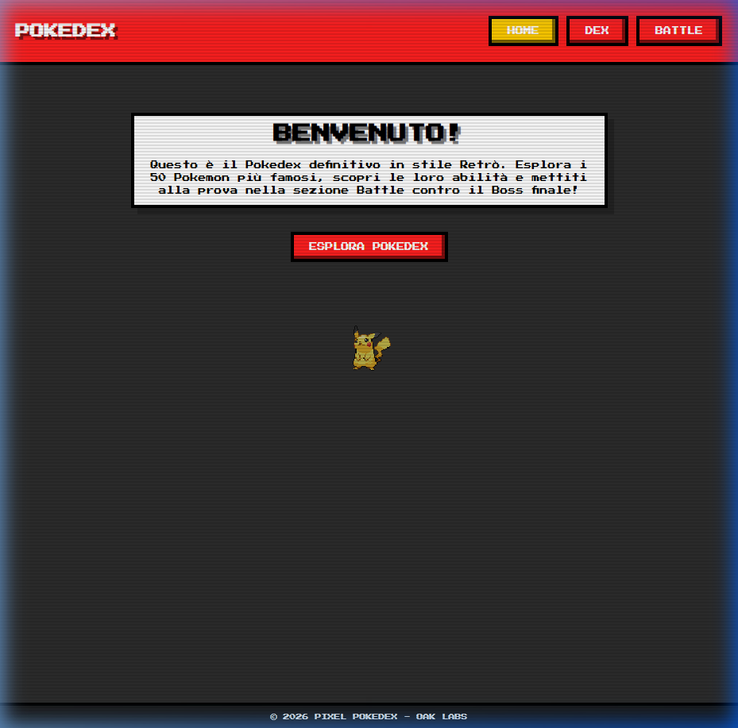
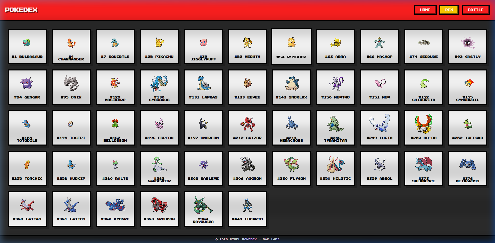
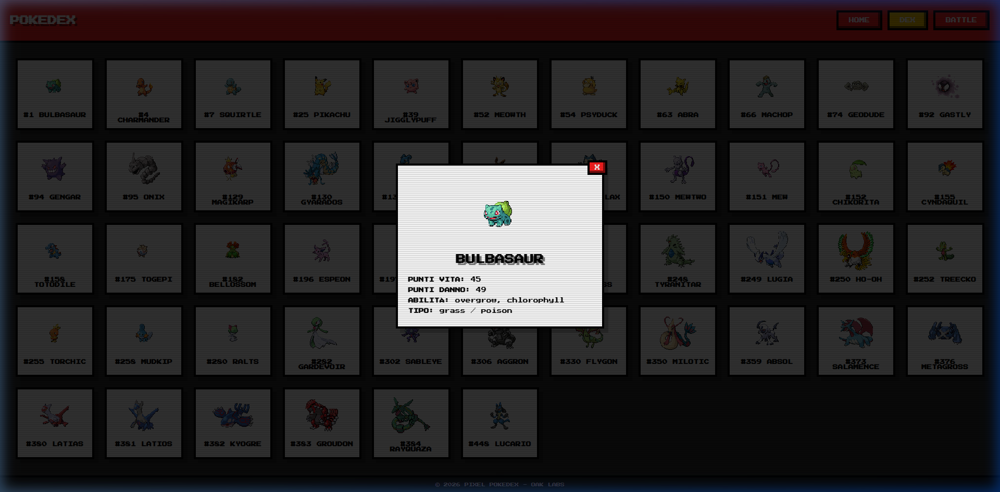
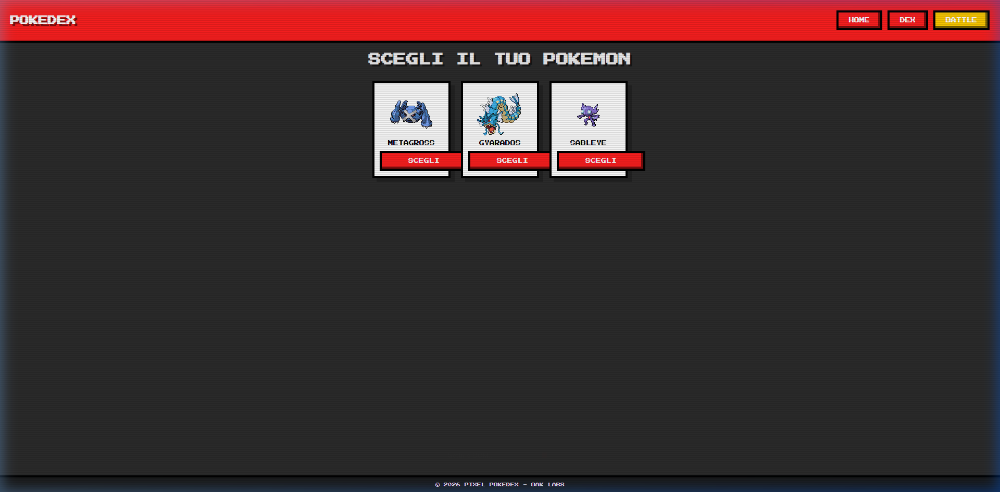
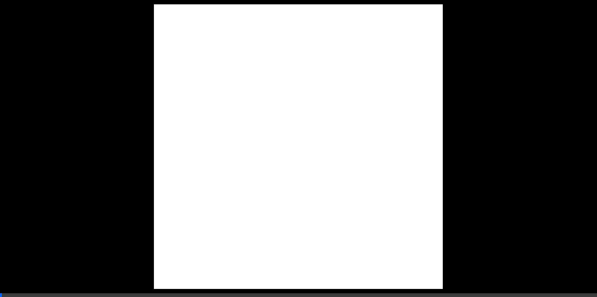

# Pixel Pokedex Walkthrough

I have completed the Pokedex project with a retro pixelated style, a dataset of 50 Pokemon, and a functional battle system.

## Features Implemented

### 1. Retro Design System
- **Pixelated Aesthetic**: Used `image-rendering: pixelated;` and "Press Start 2P" typography.
- **Grainy Overlay**: Added an animated SVG noise filter for a "vintage cartoon" feel.
- **CRT Scanlines**: Implemented a scanline overlay to complete the retro look.

### 2. Pokedex Grid
- Displays 50 famous Pokemon fetched from PokeAPI.
- **Detailed Modal**: Clicking a Pokemon opens a popup with HP, Attack, and Abilities.

### 3. Battle System
- **Selection Phase**: Choose from 3 random Pokemon.
- **Boss Fight**: Battle against a powerful Boss (Mewtwo) with turn-based logic.
- **Visual Feedback**: Health bars animate based on damage, and logs track the battle progress.
- **Win State**: Confetti celebration upon defeating the boss.

## Verification Results

### Build & Functionality
- `npm run build` executed successfully.
- All components (Home, Dex, Battle) are responsive and functional.

## UI Demonstration

- **Homepage**

- **Pokedex Grid**

- **Pokemon Details**

- **Battle Selection**

- **Battle vs Mewtwo**

### Video Tutorial

